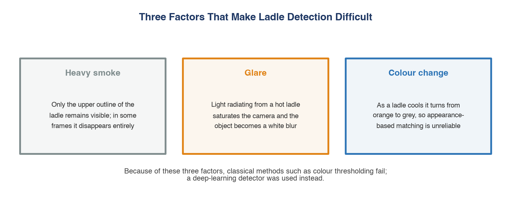
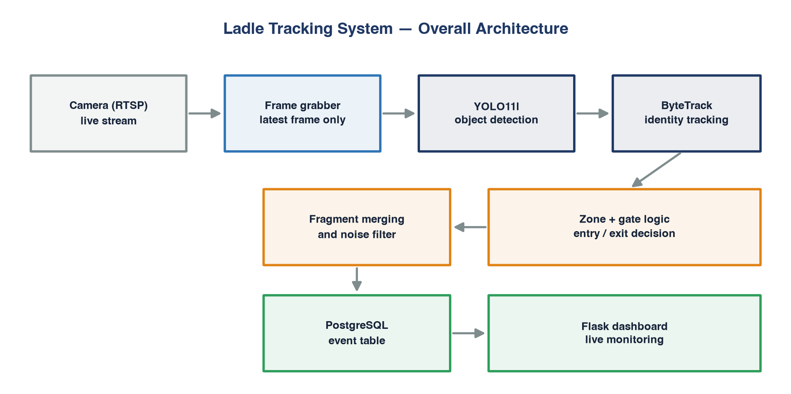
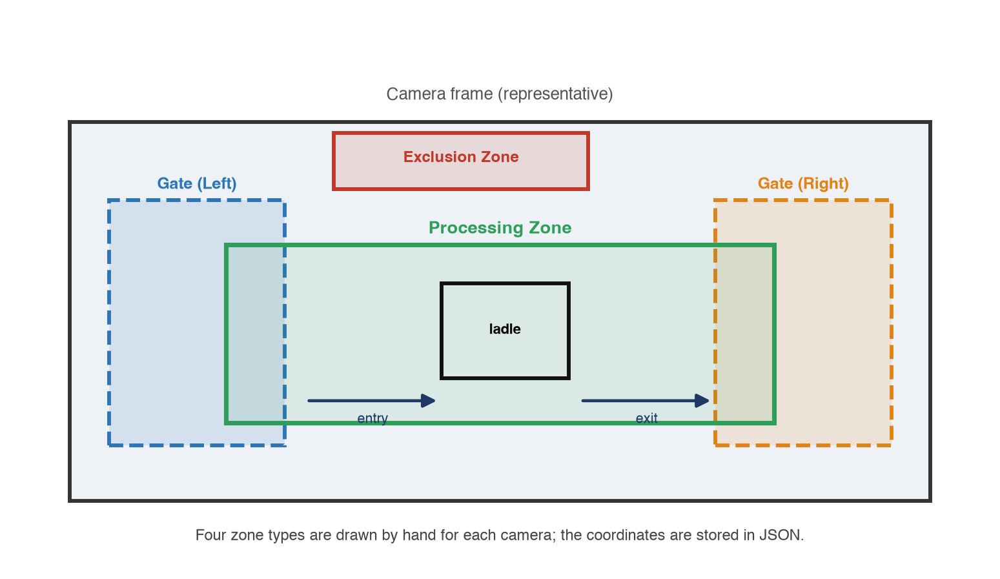
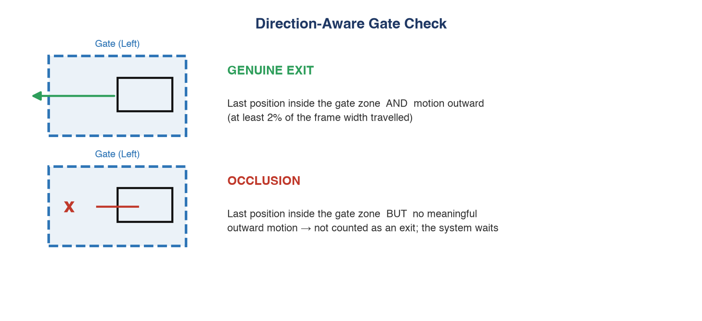
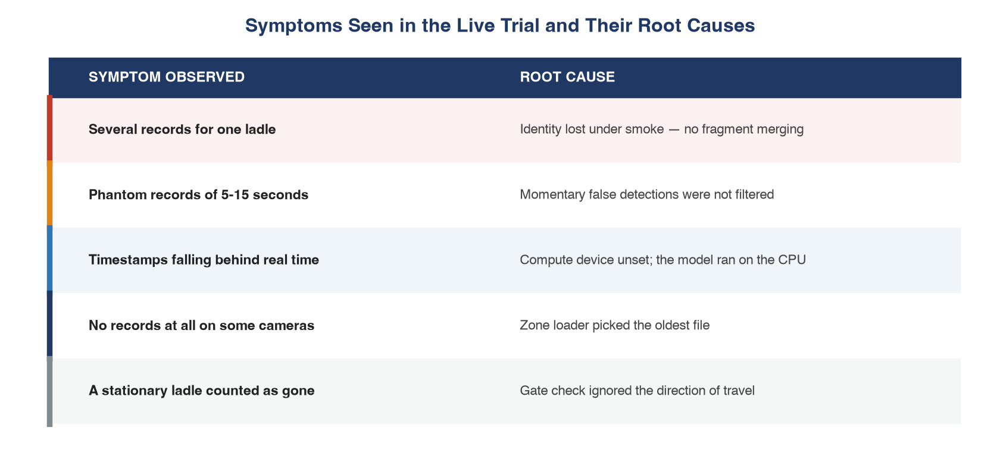
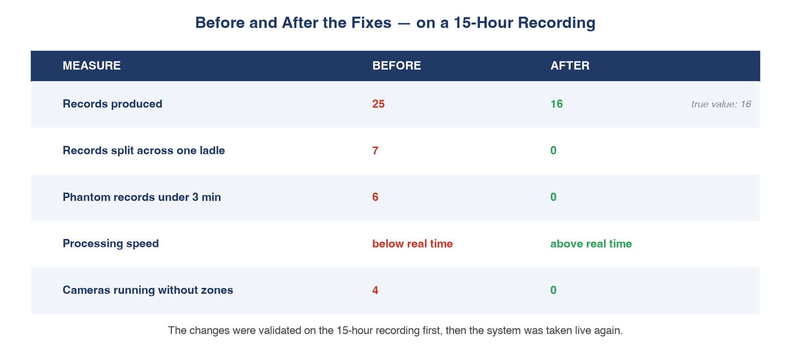
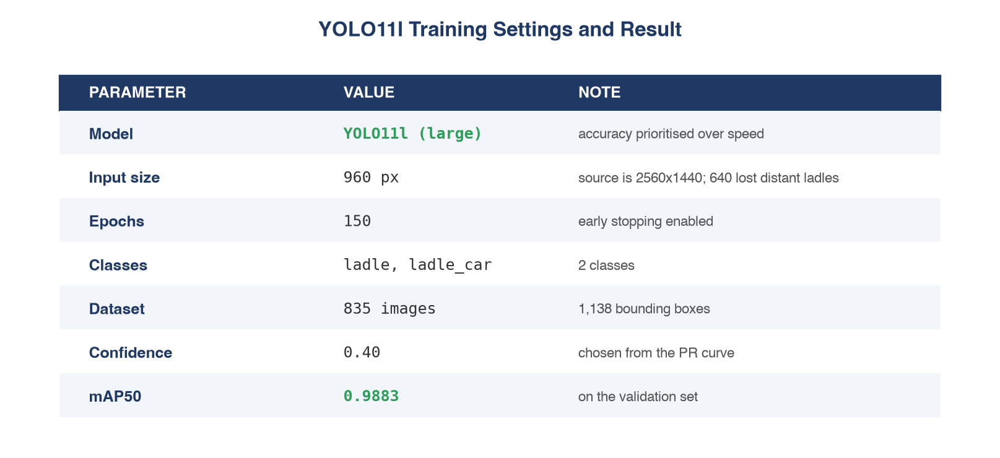
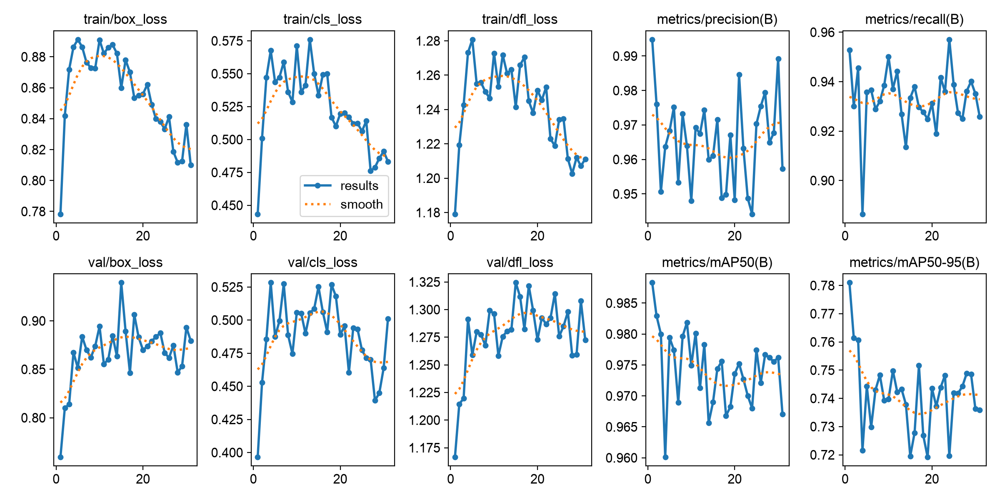
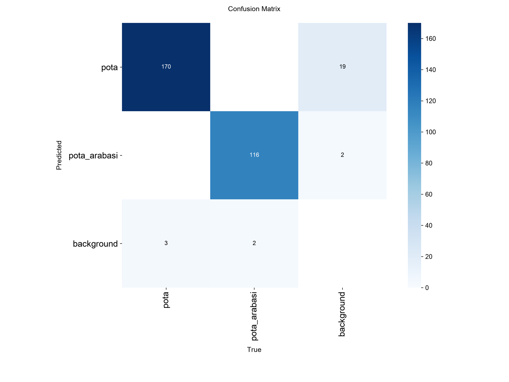
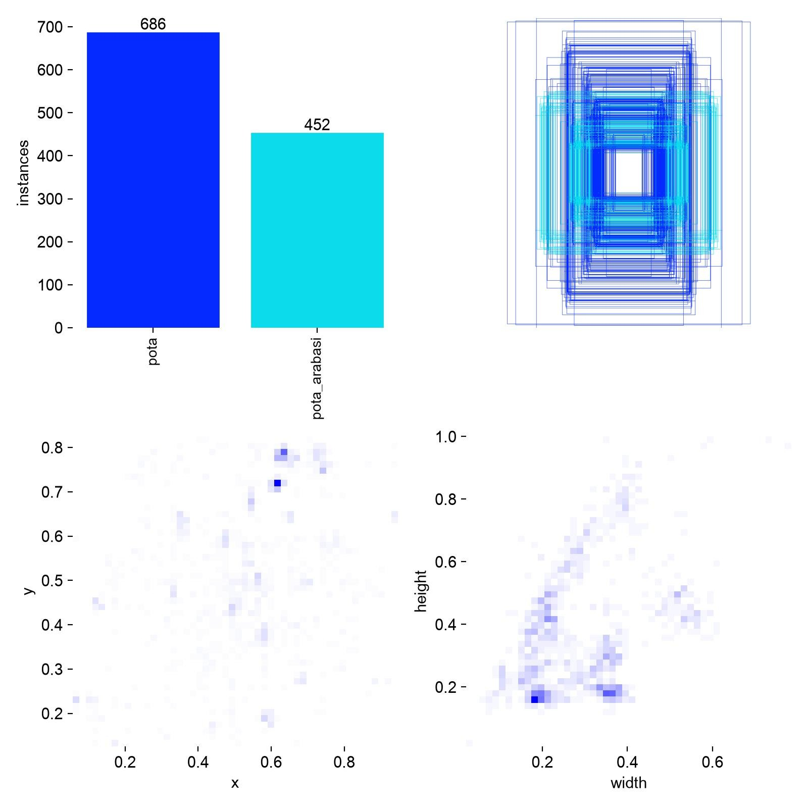

🇹🇷 **Türkçe** · [🇬🇧 English](README.md)

# Pota Takip Sistemi

Fabrika kameralarındaki potaları tespit eden, kimliklerini kareler boyunca
koruyan ve **her potanın kameraya ne zaman girip ne zaman çıktığını**
veritabanına yazan bilgisayarlı görü sistemi. Daha önce elle, kâğıt üzerinde
tutulan bir kaydın yerini alıyor.

Entegre bir demir-çelik tesisinin proses otomasyonu biriminde, yaz stajı
kapsamında geliştirildi.

> **Veri hakkında.** Kamera görüntüleri, kamera adları, eğitilmiş model
> ağırlıkları ve bölge kalibrasyon dosyaları gizlidir; bu depoda **yer almaz**.
> Yayımlanan şey kod, mimari ve kararların gerekçesidir. Yapılandırma
> örneklerindeki kamera adları jenerik yer tutuculardır (`CAM-01`…).

---

## Problem

Pota, sıvı çeliği istasyonlar arasında taşıyan kaptır. Hangi istasyona ne zaman
gelip ne zaman ayrıldığı operasyonel olarak işe yarar bir bilgi ama elle
yazılıyordu — hem yavaş hem boşluklarla dolu.

Bunu ders kitabındaki bir tespit probleminden ayıran üç şey var:



Bu üçü yüzünden renk eşikleme ve arka plan çıkarma daha en başta elendi;
öğrenen bir tespit modeline geçildi.

---

## Mimari



| Aşama | Seçim | Gerekçe |
|-------|-------|---------|
| Tespit | **YOLO11l**, 960 px girdi | Hızdan çok doğruluk — yanlış bir giriş/çıkış kaydı, geç işlenen bir kareden çok daha pahalı. 2560×1440 kaynakta 640 px uzaktaki potaları kaybediyordu. |
| Takip | **ByteTrack** | Pota soğudukça turuncudan griye döndüğü için görünüm tabanlı yeniden tanıma (BoT-SORT ReID) burada güvenilir değil. ByteTrack ayrıca düşük güvenli tespitleri de kullanıyor, bu duman altında işe yarıyor. |
| Depolama | **PostgreSQL** | Birden çok kamera eşzamanlı yazıyor; her biri ayrı servis. |
| Arayüz | **Flask** | Bölge editörü ve canlı izleme paneli. |

---

## İşi yürüten iki fikir

### 1 · Bölgeler ve yön duyarlı kapı

Kadrajın her yerindeki tespit anlamlı değil. Her kamera için elle çizilen dört
bölge var; kaynak çözünürlükle birlikte JSON'a kaydediliyor ki koordinatlar
kameradan kameraya ölçeklenebilsin:



Kritik soru şu: kaybolan bir takip kimliği ne demek? Yanlış cevaplarsan duman
birkaç dakikada bir sahte çıkış üretir:



Kapının içinde bitmek yetmiyor — nesnenin kadraj genişliğinin bir oranı kadar
dışa doğru yol almış olması da gerekiyor (`GATE_DIR_MIN_DX_FRAC`). Sistem
varsayılan olarak **geçişli** çalışıyor: pota soldan girip sağdan çıkabilir ve
gerçekten çıkmış bir pota bir daha "geri dönmüş" sayılmaz.

### 2 · Takip parçalarını birleştirme

Duman hareketsiz duran potayı gizliyor, takip nesneyi kaybediyor, duman
dağılınca yeni bir kimlik atıyor — klasik kimlik bölünmesi problemi. Görünüme
güvenilemediği için parçalar **konum ve zaman** üzerinden birleştiriliyor:

- yeni parça, eski parçanın bittiği yere yakın başlıyorsa **ve**
- eski parça gerçekten kapıdan çıkmamışsa **ve**
- aradaki boşluk `MERGE_TIME_GAP` altındaysa

**Pota arabasının** kesintisiz görünüyor olması, potanın hiç ayrılmadığına dair
ek kanıt olarak kullanılıyor. Ardından bir gürültü filtresi `MIN_TRACK_SEC`
altındaki her şeyi eliyor.

---

## Başarısız olan canlı deneme

Sistem kayıtlı videoda düzgün çalışıyordu, canlı RTSP akışlarına bağlanıp bir
vardiya boyunca çalıştırıldı. Olmadı. Belirtileri yamamak yerine her hatalı
kayıt aynı dakikanın görüntüsüyle karşılaştırıldı:



Dördü de arka planda düzeltildi, ardından model az gördüğü kameralardan
toplanan karelerle yeniden eğitildi. Tekrar canlıya alınmadan önce on beş
saatlik kesintisiz bir kayıt üzerinde doğrulandı:



On altı, videodan elle sayılan gerçek sayıyla birebir tuttu. İkinci canlı
denemede sistem beklendiği gibi çalıştı.

---

## Model



Veri seti iki turda kuruldu. İlk tur (~790 görüntü) modelin zayıf kaldığı
kameraları ortaya çıkardı; hiperparametre ayarlamak yerine **tam da başarısız
olduğu koşullardan** kare toplandı ve set 835'e çıktı. Eğitim ayarları sabit
tutuldu ki kazanç yalnızca veriden gelebilsin.

| | Eğitim eğrileri | Karışıklık matrisi | Etiket dağılımı |
|---|---|---|---|
| |  |  |  |

`ladle_car` sınıfı `ladle`'a göre daha fazla kaçırıyor — kadrajda çoğunlukla
kısmen görünüyor, arkasındaki metal yapılarla benzer renkte ve veri setinde
daha az örneği var. Sistemde yalnızca destekleyici bir rol üstlendiği için bu
kabul edildi.

---

## Depo yapısı

| Dosya | İşlevi |
|-------|--------|
| `pota_takip_sistemi_v2.py` | Ana hat — tespit, takip, bölgeler, kapılar, parça birleştirme, DB yazımı |
| `canli_kaynak.py` | RTSP kare okuyucu; hep en güncel kareyi verir, kareler birikmez |
| `bolge_editor.py` | Flask bölge editörü — örnek kare üzerine işlem bölgesi, kapı ve geçersiz alan çizme |
| `bolge_tarama.py` | Uzun kayıtları tarayıp tespit ısı haritası üretir; bölgeler tahminle değil ölçümle konur |
| `pota_dashboard.py` | Flask izleme paneli (olay tablosu, kamera filtresi, canlı yenileme) |
| `db.py` / `report.py` | Veritabanı katmanı ve komut satırı raporlama |
| `prepare_dataset.py` | Label Studio çıktısı → YOLO biçimi, kamera bazlı dengeli ayrım |
| `train_pota.py` | Eğitim giriş noktası |
| `track_pota.py` | Tek kamera prototipi |
| `baslat_tum_kameralar.sh` | `kameralar.json`'daki her kamera için ayrı servis başlatır |

## Çalıştırma

```bash
python -m venv venv && venv/bin/pip install -r requirements.txt
createdb ladle_db

# kayıtlı video üzerinde
python pota_takip_sistemi_v2.py track --video kayit.mp4 --camera CAM-01

# canlı
python pota_takip_sistemi_v2.py track \
  --video "rtsp://<user>:<pass>@<camera-host>:554/stream1" --camera CAM-01

python bolge_editor.py     # bölge editörü  → :8001
python pota_dashboard.py   # izleme paneli   → :8000
```

Kamera listesi ve RTSP adresleri `kameralar.json` içinde. Çok kameralı ve
systemd kurulumu için `CANLI_KURULUM.md`.

## Notlar

- Kod yorumları ve değişken adları Türkçe, belgelendirme iki dilde.
- Aygıt seçimi CUDA → MPS → CPU sırasıyla düşer; CPU'ya düşerse yüksek sesle
  uyarır, çünkü YOLO11l orada canlı akışa yetişemez.
